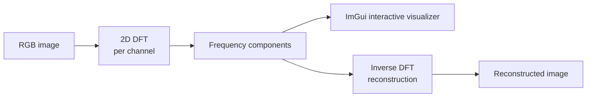

# CppFourier Architecture

## DFT pipeline

```mermaid
flowchart LR
    IMG[RGB image] --> DFT[2D DFT<br/>per channel]
    DFT --> FREQ[Frequency components]
    FREQ --> VIS[ImGui interactive visualizer]
    FREQ --> RECON[Inverse DFT<br/>reconstruction]
    RECON --> OUT[Reconstructed image]
```
